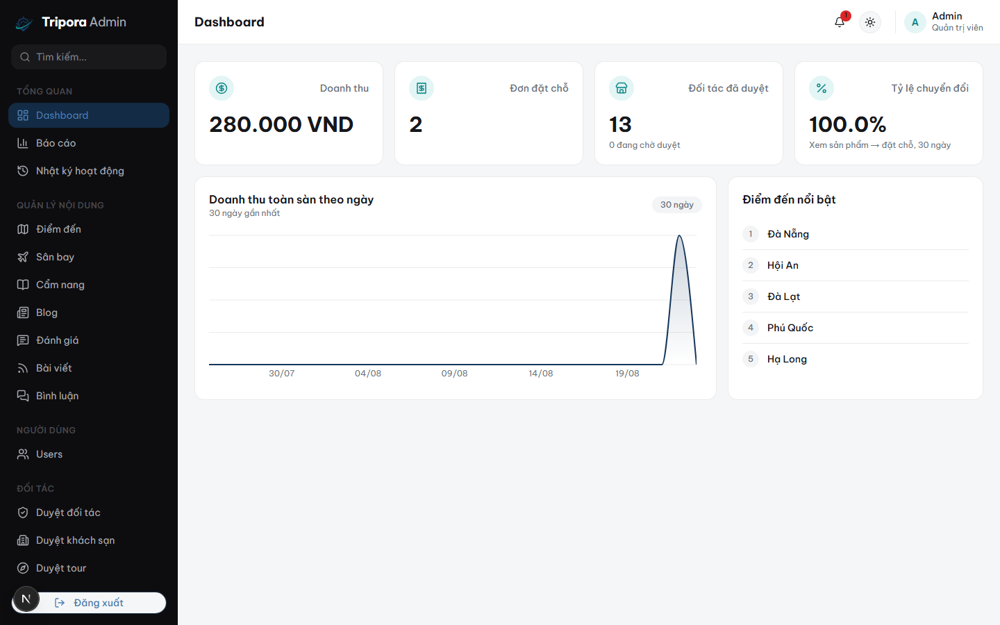
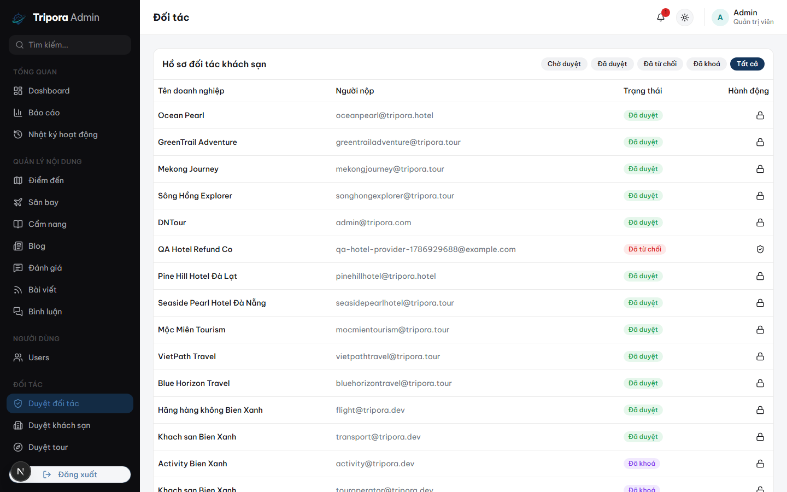
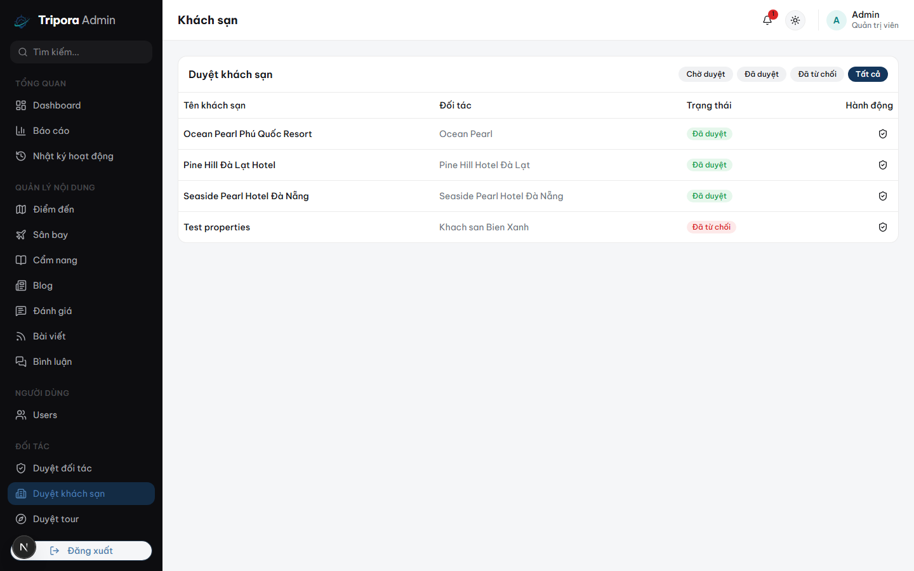

# Tripora — Admin & Provider Dashboard

The operations console for **Tripora**, a full-stack travel marketplace — one app serving two very different audiences: **platform Admins** moderating content and reviewing analytics, and **Provider organizations** (hotels, tour operators, transport companies, airlines) running their own storefront through the exact same UI shell.

Part of a 3-repo system: this app, the [backend API](https://github.com/nguyendotai/Tripora-backend), and the [customer-facing app](https://github.com/nguyendotai/Tripora-site).

**🔗 Live demo:** [tripora-admin.vercel.app](https://tripora-admin.vercel.app/)
> The backend runs on a free instance — first load can take 30–60s if it's been idle.

**Demo credentials:**

| Role | Email | Password |
| :--- | :--- | :--- |
| Platform Admin | `demo-admin@tripora.dev` | `TriporaDemo2026!` |
| Provider Owner (Tour operator, real booking/commission data) | `demo-provider@tripora.dev` | `TriporaDemo2026!` |



## Highlights

- **One app, two roles, role-aware navigation.** The sidebar is built dynamically from `providerType` + `orgRole` — an Admin sees moderation queues and platform analytics; a hotel Owner sees their own properties, bookings, and revenue; a Booking Staff member sees a strict subset of that. No separate app or build per role.
- **Multi-tenant Provider Portal** — Overview (revenue/transactions), Customers, Analytics (30-day revenue + occupancy charts), Reviews, Promotions, and Payouts, all automatically scoped to the logged-in provider's own organization.
- **Moderation queues for every content type** — provider onboarding (with submitted documents), 5 product domains, reviews, community posts, and comments — approve/reject/delete with audit trail.
- **Real-time notification bell** backed by Socket.IO, and a full audit log of sensitive admin actions (approvals, suspensions, manual payouts).
- **Charts built on real data**, not mocks — revenue-over-time, booking volume, and inventory occupancy, computed server-side and rendered with `recharts`.



## Tech Stack

| Layer | Choice |
| :--- | :--- |
| Framework | [Next.js](https://nextjs.org/) (App Router, React 19) |
| Language | TypeScript |
| Styling | Tailwind CSS v4 |
| UI Components | shadcn/ui |
| State / Data | Redux Toolkit + RTK Query |
| Charts | recharts |
| Forms | React Hook Form + Zod |
| Realtime | Socket.IO client |

## A Few Implementation Details

- **Navigation is a pure function of two independent axes** — `providerType` picks *which* nav group (Hotel vs. Tour vs. Transport vs. Flight operator), `orgRole` picks *which items* within the shared "Organization" group (Owner/Manager see Members & Promotions, Finance Staff sees Revenue, Booking Staff sees Customers) — adding a new role-gated page is a one-line addition to a config array, not a new route guard.
- **Route guards here are UX only.** Every permission is re-checked server-side; a redirect on the wrong page just avoids a confusing 403 flash, it's never the actual security boundary.
- **Badge-driven moderation tables.** The reviews table resolves whichever of 5 possible target IDs (`propertyId`/`tourId`/`experienceId`/`flightId`/`destinationId`) is set on a row into a labeled badge + product name — extending it to a new bookable type is a new `if` branch, not a new component.

## Getting Started

```bash
npm install
cp .env.example .env   # set NEXT_PUBLIC_API_BASE_URL
npm run dev
```

Open [http://localhost:3002](http://localhost:3002). Requires the [backend API](https://github.com/nguyendotai/Tripora-backend) running at `http://localhost:5550` (default `NEXT_PUBLIC_API_BASE_URL`), and at least one `ADMIN`-role account to sign in with.

## Screenshots

<details>
<summary>Hotel moderation queue</summary>



</details>

## Design System

Fixed dark sidebar across both themes; content area supports Light (default) / Dark / System. Brand colors: navy `#14365C` + teal `#0C8788`. Tokens declared in `src/app/globals.css`.

## Project Structure

```
src/
  app/         # App Router: routes, layouts, providers (Theme)
  features/    # feature-scoped API slices, components, types (property, review, provider, ...)
  modules/     # page-level composition (dashboard, ...)
  shared/      # cross-cutting components (sidebar, header, theme-toggle, ...)
  components/  # shadcn/ui primitives
```

## Scripts

| Command | Description |
| :--- | :--- |
| `npm run dev` | Start dev server on port `3002` |
| `npm run build` | Production build |
| `npm run start` | Run the production build |
| `npm run lint` | Lint |
